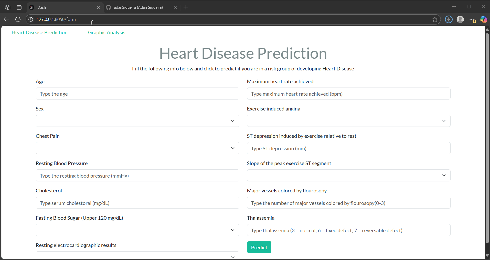

<h1 align="center">Heart Disease Prediction Dashboard</h1>
<p align="center">
  
  
  
  
  
  
</p>

This project presents a dynamic and interactive web application for predicting the risk of heart disease based on clinical data. The model and dashboard are built upon a well-known dataset from the [UCI Machine Learning Repository](https://archive.ics.uci.edu/dataset/45/heart+disease), derived from angiographic results of 303 patients at the Cleveland Clinic Foundation, Ohio.

## 🔍 Project Overview

This application is divided into two main pages:

### 1. **Heart Disease Prediction**

A form-based interface allows users to input patient information such as:
- Age, Sex
- Blood pressure and cholesterol levels
- Fasting blood sugar
- Electrocardiogram results
- Maximum heart rate
- Exercise-induced angina
- ST depression, among others

Once submitted, these values are passed to a machine learning model trained using **XGBoost**, which classifies whether the patient is at risk of having heart disease.

### 2. **Graphic Analysis**

This page provides multiple interactive visualizations using **Plotly**, enabling users to explore trends and patterns from the dataset, such as:
- Heart disease distribution by age and sex
- Relationship between cholesterol or blood pressure and heart disease
- Blood sugar and ECG pattern analysis

These charts offer valuable insights into the clinical features correlated with heart conditions.

---

## 🚀 Why This Project Matters

Heart disease remains one of the leading causes of death worldwide. A predictive tool like this can help medical professionals, students, and data enthusiasts identify risk patterns more quickly and efficiently. By combining explainable machine learning with a user-friendly interface, this project demonstrates the power of applied AI in healthcare diagnostics and education.

---

## 🛠️ Technologies Used

- **Dash** & **Dash Bootstrap Components**: For web app development
- **Pandas** & **NumPy**: For data manipulation
- **Plotly**: For interactive visualizations
- **XGBoost**: For building the classification model
- **ucimlrepo API**: For accessing the UCI dataset programmatically
- **Jupyter Notebook**: For exploratory data analysis and model development

## Project Demonstration:



---

## 🧪 How to Run Locally

1. Clone the repository:
   ```bash
   git clone https://github.com/your-username/your-repository-name.git
   cd your-repository-name
2. Install dependencies:
   ```bash
   pip install -r requirements.txt
   
3. Run the app:
   ```bash
   python main.py 
   
