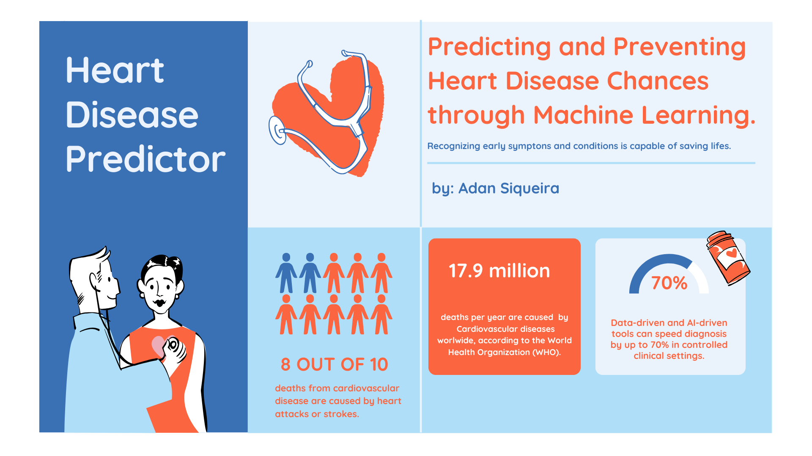

<h1 align="center">Heart Disease Prediction Dashboard</h1>
<p align="center">
  
  
  
  
  
  
</p>

This project presents a dynamic and interactive web application for predicting the risk of heart disease based on clinical data. The model and dashboard are built upon a well-known dataset from the [UCI Machine Learning Repository](https://archive.ics.uci.edu/dataset/45/heart+disease), derived from angiographic results of 303 patients at the Cleveland Clinic Foundation, Ohio.

> 🧾 This repository includes the notebook [`Predictor_Model_Development.ipynb`](./Predictor_Model_Development.ipynb), where the entire process of data import, cleaning, transformation, exploration, visualization, and machine learning model development is detailed and reproducible. This ensures transparency and traceability of all steps taken.

> ☁️ Additionally, the project was deployed to the web via **Google Cloud Platform**, using **Google Cloud Run** and **Cloud Build** for automated Docker-based deployment directly from this GitHub repository. This strategy offers fast, scalable, and serverless deployment, simplifying infrastructure management while ensuring that new changes pushed to the repo are continuously integrated and deployed. You can access it on https://heartdiseasepredictor-276412923171.europe-west1.run.app/ .

---

## 🔍 Project Overview

This application is divided into two main pages:

### 1. **Heart Disease Prediction**

A form-based interface allows users to input patient information such as:
- Age, Sex
- Blood pressure and cholesterol levels
- Fasting blood sugar
- Electrocardiogram results
- Maximum heart rate
- Exercise-induced angina
- ST depression, among others

Once submitted, these values are passed to a machine learning model, which classifies whether the patient is at risk of having heart disease.

### 2. **Graphic Analysis**

This page provides multiple interactive visualizations using **Plotly**, enabling users to explore trends and patterns from the dataset, such as:
- Heart disease distribution by age and sex
- Relationship between cholesterol or blood pressure and heart disease
- Blood sugar and ECG pattern analysis

These charts offer valuable insights into the clinical features correlated with heart conditions.

---

## Model Development and Performance

The initial phase included training and evaluating multiple classification models. After experimentation, an Ensembling with **XGBoost**, **Random Forest** and **Logistic Regression** were selected for optimization and final deployment. The model was trainedand optimized  using a robust pipeline with:

- **StandardScaler** for feature normalization  
- **Bayesian optimization** (`BayesSearchCV`) for hyperparameter tuning  
- **Nested cross-validation** for unbiased performance estimation

**Voting Classifier (Soft Voting)**, an ensemble model combining **Logistic Regression**, **Random Forest**, and **XGBoost**, was also tested. After optimizing each model individually, the ensemble model achieved solid performance in identifying heart disease, leveraging the complementary strengths of each individual model.

📈 **Final test set performance (class 1 = heart disease):**

| Metric    | Class 0 | Class 1 |
|-----------|---------|---------|
| Precision | 0.90    | 0.86    |
| Recall    | 0.88    | 0.89    |
| F1-Score  | 0.89    | 0.88    |

The model achieved **0.89 recall on class 1**, meaning it correctly identified 89% of patients with heart disease — a crucial metric for medical prediction tasks where false negatives are costly.

---

## Why This Project Matters

Heart disease remains one of the leading causes of death worldwide. A predictive tool like this can help medical professionals, students, and data enthusiasts identify risk patterns more quickly and efficiently. By combining explainable machine learning with a user-friendly interface, this project demonstrates the power of applied AI in healthcare diagnostics and education.

---

## 🛠️ Technologies Used

- **Dash** & **Dash Bootstrap Components**: For web app development  
- **Pandas** & **NumPy**: For data manipulation  
- **Plotly**: For interactive visualizations  
- **XGBoost**, **RandomForest**, and **Scikit-Learn**: For model training and tuning  
- **ucimlrepo API**: For accessing the UCI dataset programmatically  
- **Jupyter Notebook**: For exploratory data analysis and model development  
- **Google Cloud Platform (Cloud Run + Cloud Build)**: For containerized deployment

---

## 📺 Project Demonstration


---

## How to Run Locally

1. **Clone the repository:**
   ```bash
   git clone https://github.com/adanSiqueira/HeartDiseasePredictor.git
   cd your-repository-name

2. **Install requirements.txt**
   ```bash
   pip install -r requirements.txt

3. **Run Locally**
   ```bash
   python main.py

Or, access the web app deployed on Google Cloud Service at: https://heartdiseasepredictor-276412923171.europe-west1.run.app/
